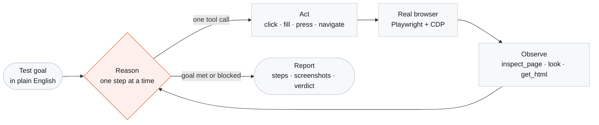

<div align="center">


# Probe

**An autonomous QA engineer that drives a real browser. It never reads your source — it tests the running app, exactly like a human would.**

[](LICENSE)
[](https://nodejs.org)
[](https://react.dev)
[](https://hono.dev)
[](https://playwright.dev)
[](CONTRIBUTING.md)

[Why Probe](#why-probe) · [How the agent works](#how-the-agent-works) · [Quick start](#quick-start) · [Configuration](#configuration) · [Contributing](#contributing)

</div>

---

## Why Probe

Most "AI testing" tools generate test code. You still own that code, it still breaks when a button moves, and it still asserts against mocks rather than the thing your users touch.

Probe takes the other path. You describe the outcome in a sentence — *"sign up, create a project, invite a teammate"* — and the agent opens a real browser and does it. No selectors to maintain, no fixtures to update, no source access at all. If a human could do it in your app, Probe can attempt it, and it reports what actually happened.

That constraint is deliberate: **the agent only sees what a user sees.** It can't be fooled by a passing unit test over a broken UI.

---

## How the agent works

Probe is a ReAct loop over a persistent browser page. Every turn is: reason about one next step, call exactly one tool, observe the result, repeat — until the goal is met or it can prove it isn't reachable.



### Accessibility-first perception

The interesting design decision is how the agent *sees*. Screenshots alone are expensive and ambiguous; raw DOM is enormous and mostly noise. Probe leads with the **accessibility tree**, and falls back to the DOM only when that isn't enough:

| Tool | What it returns | When it's used |
|---|---|---|
| `inspect_page()` | Accessibility tree, selector hints for unnamed inputs, the **active scope**, and every button/input inside it with role, label, testid, icon-only flag and bounding rect | Primary — the default way to look |
| `look()` | Screenshot **+** tree **+** url **+** title in one call | After navigation or any state-changing action |
| `screenshot()` | Just the rendered image | Visual-only questions: alignment, broken images, overlays |
| `get_html(selector?)` | Full DOM with every attribute | Fallback for custom widgets the tree didn't name |

**Active scope** is what makes this work on real apps. When a modal or dropdown is open, `inspect_page()` reports `activeScope: "dialog"` and lists only the controls inside it — so the agent physically cannot click the button hidden behind the overlay, which is the classic failure mode for selector-driven bots.

Icon-only buttons — the send arrow, the close ✕, the paperclip — get an `iconOnly: true` flag plus an SVG hint and a bounding rect, so the agent can pick the submit control by position and shape when it has no accessible name at all.

### Acting

`click(role, name)` and `fill(name, text)` address elements by the accessible names the agent just read, not by brittle CSS paths. A CSS selector is the escape hatch, not the default. When several actions need no decision between them, `do_steps([...])` chains them in a single call — fill, fill, click, wait — which cuts both latency and token cost.

The agent is forbidden from acting on any element it hasn't just observed. No blind clicking.

---

## What's in the app

| | |
|---|---|
| **Agents** | Named, reusable test agents with a goal, a target URL and a schedule |
| **Runs** | Every execution kept with its full step trace, screenshots and verdict |
| **Recordings** | Session capture for replaying and inspecting what the agent saw |
| **Flows** | Multi-step journeys assembled from chat, saved and re-run |
| **Live browser view** | `/api/browser/stream` streams frames so you can watch a run in progress |
| **Scheduler** | Recurring runs, so a regression shows up before your users find it |
| **Email agent** | An [AgentMail](https://agentmail.to) inbox, so flows involving signup links and OTPs can complete end to end |
| **GitHub integration** | Run results attached back to the repo that changed |

---

## Quick start

**Requirements:** Node ≥ 22 and a Postgres database ([Neon](https://neon.tech) has a free tier).

```bash
git clone https://github.com/hritvikgupta/probeqa.git
cd probeqa
npm install
npx playwright install chromium

cp .env.example .env      # set DATABASE_URL and OPENROUTER_API_KEY
npm run db:push
npm run dev               # web + agent server together
```

| Command | What it does |
|---|---|
| `npm run dev` | Web and agent server together |
| `npm run dev:web` / `dev:agent` | Either half on its own |
| `npm run build` | Production bundle |
| `npm run db:push` | Push the Drizzle schema |

---

## Configuration

| Variable | Required | Purpose |
|---|:--:|---|
| `DATABASE_URL` | ✅ | Postgres connection string |
| `OPENROUTER_API_KEY` | ✅ | Model access for the agent loop |
| `COMPOSIO_API_KEY` | | Third-party tool connections |
| `AGENTMAIL_API_KEY` | | Inbox for signup / OTP flows |
| `DODO_API_KEY` | | Billing — omit and everyone stays free |

> [!WARNING]
> Every key above is **server-side only**. The agent runs a real browser against real credentials — treat a Probe deployment with the same care as a CI runner that can log into your app.

---

## Project layout

```
server/
  agent.ts        the ReAct loop
  prompt.ts       the system prompt — the agent's operating manual
  browser.ts      Playwright + CDP: inspect_page, look, click, fill, do_steps
  reflect.ts      self-check between steps
  recording.ts    session capture
  scheduler.ts    recurring runs
  emailAgent.ts   AgentMail inbox handling
  db/             Drizzle schema and client
src/
  views/          Overview, Agents, Runs, Recordings, Billing, Docs, Landing
```

Start with [`server/prompt.ts`](server/prompt.ts) — it's the clearest statement of how the agent is meant to behave.

---

## Roadmap

- [ ] Parallel runs across a browser pool
- [ ] Assertion primitives beyond natural-language verdicts
- [ ] Cross-browser targets (Firefox, WebKit)
- [ ] Flake detection by re-running divergent steps
- [ ] Self-hosted model support

---

## Contributing

Issues and pull requests are welcome — see [CONTRIBUTING.md](CONTRIBUTING.md).

The most useful contributions are usually to **perception**: a widget pattern `inspect_page()` doesn't yet describe well is a concrete, testable improvement that makes every agent run better.

---

## License

[GNU AGPL-3.0](LICENSE) © 2026 Hritvik Gupta.

You may use, modify and self-host Probe freely. If you run a modified version **as a network service**, the AGPL requires you to publish your changes under the same license.
