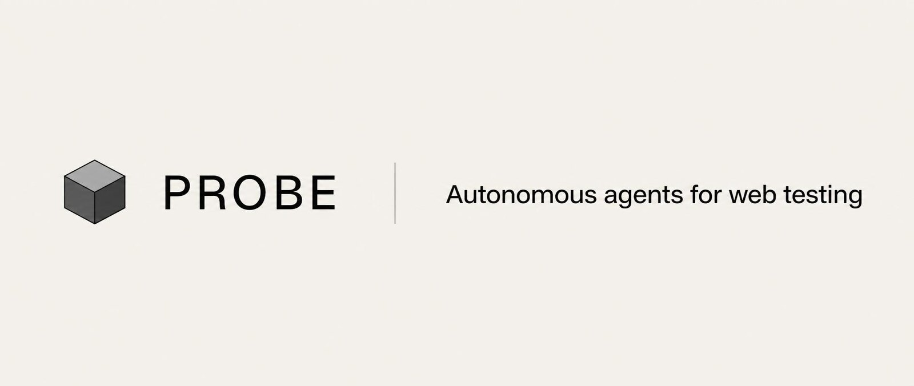
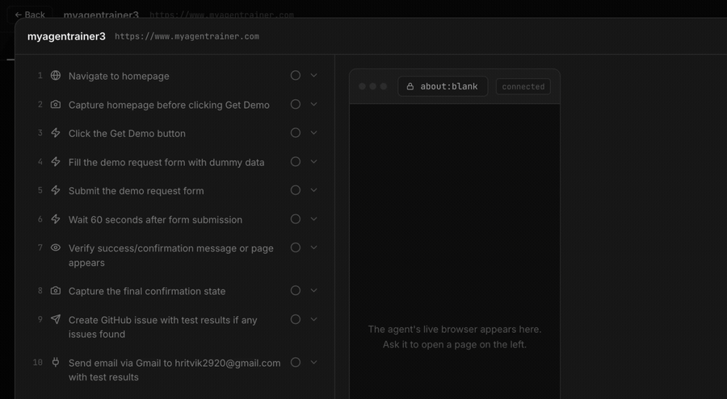
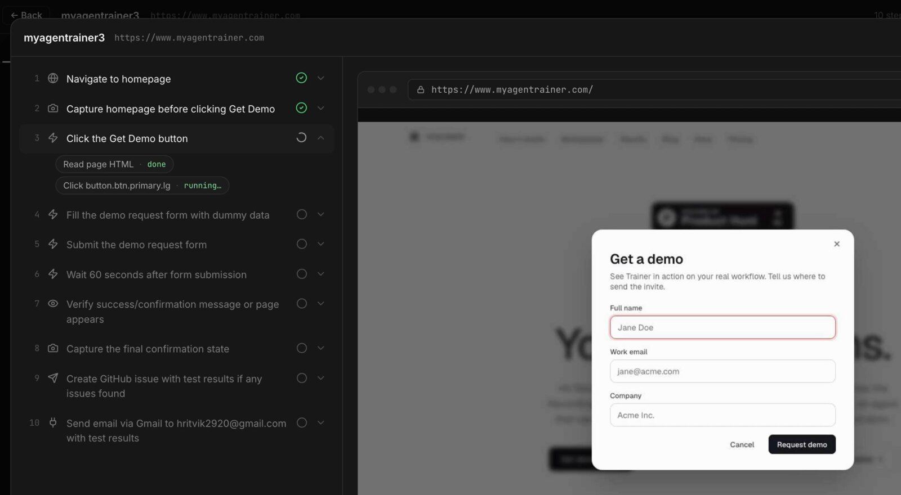
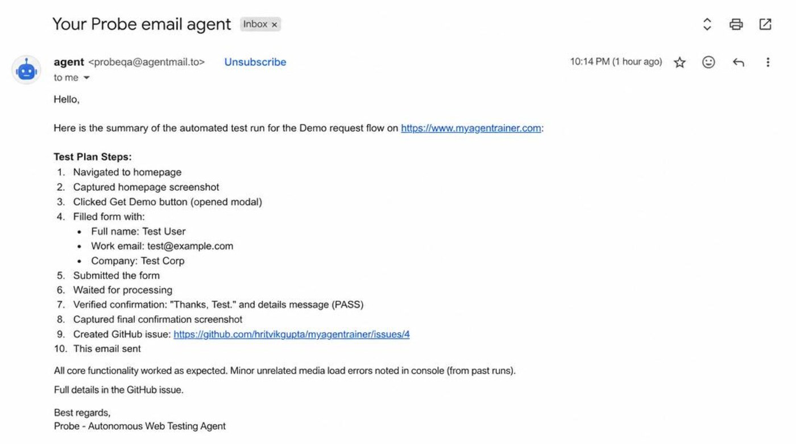
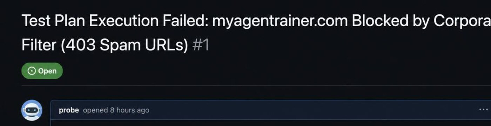

<div align="center">



# Probe

**An autonomous QA engineer that drives a real browser. It never reads your source — it tests the running app, exactly like a human would.**

[](LICENSE)
[](https://nodejs.org)
[](https://react.dev)
[](https://hono.dev)
[](https://playwright.dev)
[](https://www.postgresql.org)
[](CONTRIBUTING.md)

[Why Probe](#why-probe) · [Watch it work](#watch-it-work) · [The algorithm](#the-algorithm) · [What it produces](#what-it-produces) · [Quick start](#quick-start) · [Configuration](#configuration) · [Contributing](#contributing)

</div>

---

## Why Probe

Every other "AI testing" tool writes test code for you. That sounds like the win until you own the output: the selectors still rot when a button moves, the assertions still run against mocks, and you've traded writing tests for reviewing generated ones.

Probe refuses the premise. You write the outcome in a sentence —

> *"Go to the site, request a demo, fill the form, confirm it succeeded, and open a GitHub issue if anything breaks."*

— and the agent opens a real Chromium page and does it. No selectors. No fixtures. **No access to your source code at all.**

That last constraint is the product. An agent that can read your code can be convinced by your code. Probe only ever sees what a user sees, so a green run means the thing your customers touch actually worked — not that a mock returned what a stub expected.

---

## Watch it work

One sentence in. The agent plans the steps, drives the browser, and reports.



The left rail is the agent's plan, checked off as each step completes. The right pane is the live browser it is controlling — the same frames streamed over `/api/browser/stream`, so you can watch a run in progress instead of reading a log afterwards.



---

## The algorithm

Probe is a **ReAct loop** over a single persistent browser page. Every turn is exactly: reason about one next step → call one tool → observe the result → repeat, until the goal is met or the agent can prove it isn't reachable.


### 1 — Perception: accessibility tree first, DOM last

How the agent *sees* is the whole ballgame. Screenshots alone are expensive and ambiguous — an LLM staring at pixels guesses at what's clickable. Raw DOM is the opposite failure: tens of thousands of tokens, almost all of it noise.

Probe leads with the **accessibility tree**, which is the browser's own semantic model of the page, and drops to the DOM only when that isn't enough.

| Tool | Returns | When |
|---|---|---|
| `inspect_page()` | Accessibility tree, selector hints for unnamed inputs, the **active scope**, and every button/input inside it with role, label, testid, `iconOnly` flag, SVG hint and bounding rect | **Primary** — the default way to look |
| `look()` | Screenshot **+** tree **+** url **+** title in one call | After navigating or any state-changing action |
| `screenshot()` | Just the rendered image | Visual-only questions: alignment, broken images, overlays |
| `get_html(selector?)` | Full DOM, every attribute | Fallback when the tree didn't name a custom widget |

### 2 — Active scope: the fix for modals

The single most common way a browser agent fails is clicking something behind an open dialog. Selector-driven bots do it constantly, because a CSS selector doesn't know a modal is covering the page.

`inspect_page()` reports an **`activeScope`** — `"dialog"` when a modal is open, `"menu"` for a popover, `"main"` when neither — and lists only the controls inside it. While a dialog is open, everything outside it is ineligible. The agent physically cannot reach the button underneath.

### 3 — Icon-only buttons

Send arrows, close ✕, paperclips: real interfaces are full of buttons with no accessible name. Each candidate carries `iconOnly: true`, an `svgHint`, and a bounding rect `{x, y, w, h}` — so the agent can identify the submit control by *shape and position* (bottom-right of a composer, say) when there is no text to match on.

### 4 — Acting

`click(role, name)` and `fill(name, text)` address elements by the accessible names the agent just read. A CSS selector is the escape hatch, never the default. Two rules keep the loop honest:

- **One tool call per reasoning step** — so every action has exactly one observation, and a failed run is readable top to bottom.
- **Never act on an unobserved element** — the agent may only touch something it just saw in an `inspect_page` or `get_html` result. No blind clicking.

When several actions need no decision between them, `do_steps([...])` chains them in a single call — fill, fill, click, wait — cutting both latency and token spend.

### 5 — Reflection and recovery

After a state-changing action, [`server/reflect.ts`](server/reflect.ts) asks whether the page actually changed the way the agent predicted. A mismatch is a signal, not a failure: the agent re-observes and picks a different route rather than continuing down a plan that has already diverged from reality.

---

## What it produces

A run isn't a pass/fail bit. It's an account of what happened, delivered where the team already works.

**A written report by email**, via an [AgentMail](https://agentmail.to) inbox — which also means the agent can *receive* mail, so flows involving signup links and one-time codes complete end to end instead of stalling at the verification step.



**A GitHub issue** on the repo that changed, with the verdict and the environment detail needed to reproduce it.



Both are generated from the same run record, so the issue, the email and the UI never disagree.

---

## What's in the app

| | |
|---|---|
| **Agents** | Named, reusable agents with a goal, a target URL and a schedule |
| **Runs** | Every execution with its full step trace, screenshots and verdict |
| **Recordings** | Session capture for replaying exactly what the agent saw |
| **Flows** | Multi-step journeys assembled in chat, saved and re-run |
| **Live browser** | `/api/browser/stream` streams frames while a run is in progress |
| **Scheduler** | Recurring runs, so regressions surface before your users find them |
| **Email agent** | A real inbox — signup links and OTPs no longer block a flow |
| **GitHub** | Issues filed against the repo, results attached to the change |
| **Billing** | Plan and usage management via Dodo Payments |

---

## Quick start

**Requirements:** Node ≥ 22, a Postgres database ([Neon](https://neon.tech) has a free tier), and Chromium for Playwright.

```bash
git clone https://github.com/hritvikgupta/probeqa.git
cd probeqa
npm install
npx playwright install chromium

cp .env.example .env      # DATABASE_URL + OPENROUTER_API_KEY
npm run db:push
npm run dev               # web + agent server
```

| Command | What it does |
|---|---|
| `npm run dev` | Web and agent server together |
| `npm run dev:web` / `dev:agent` | Either half on its own |
| `npm run build` / `preview` | Production bundle |
| `npm run db:push` | Push the Drizzle schema |

---

## Configuration

| Variable | Required | Purpose |
|---|:--:|---|
| `DATABASE_URL` | ✅ | Postgres connection string |
| `OPENROUTER_API_KEY` | ✅ | Model access for the agent loop |
| `COMPOSIO_API_KEY` | | Third-party tool connections |
| `AGENTMAIL_API_KEY` | | Inbox for signup / OTP flows and email reports |
| `GITHUB_TOKEN` | | Filing issues from a run |
| `DODO_API_KEY` | | Billing — omit and everyone stays free |

> [!WARNING]
> Every key above is **server-side only**. Probe drives a real browser against real credentials on real sites — treat a deployment with the same care as a CI runner that can log into your app, and point it at staging before production.

---

## Project layout

```
server/
  agent.ts        the ReAct loop
  prompt.ts       the system prompt — the agent's operating manual
  browser.ts      Playwright + CDP: inspect_page, look, click, fill, do_steps
  reflect.ts      post-action self-check and recovery
  recording.ts    session capture
  scheduler.ts    recurring runs
  emailAgent.ts   AgentMail inbox handling
  billing.ts  auth.ts  composio.ts  store.ts
  db/             Drizzle schema and client
src/
  views/          Overview, Agents, Runs, Recordings, Billing, Docs, Blog, Landing
```

Read [`server/prompt.ts`](server/prompt.ts) first — it is the clearest statement of how the agent is meant to behave, and most behaviour changes start there or in `browser.ts`.

---

## Roadmap

- [ ] Parallel runs across a browser pool
- [ ] Assertion primitives alongside natural-language verdicts
- [ ] Cross-browser targets (Firefox, WebKit)
- [ ] Flake detection by re-running divergent steps
- [ ] Self-hosted model support
- [ ] Trace export to OpenTelemetry

---

## Contributing

Issues and pull requests are welcome — see [CONTRIBUTING.md](CONTRIBUTING.md).

The highest-leverage contribution is **perception**: a widget pattern `inspect_page()` doesn't describe well is concrete, testable, and improves every run the agent will ever make. That work belongs in `server/browser.ts`, not in the prompt.

---

## License

[GNU AGPL-3.0](LICENSE) © 2026 Hritvik Gupta.

You may use, modify and self-host Probe freely. If you run a modified version **as a network service**, the AGPL requires you to publish your changes under the same license.
